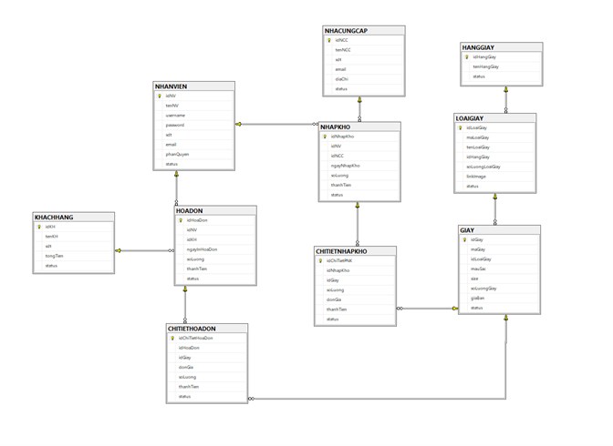
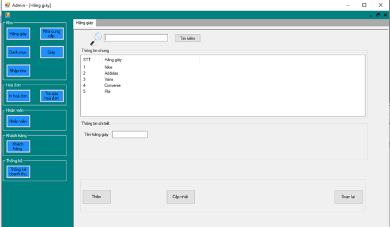

# Sale-Management-Application

## Table of Contents
* [About The Project](#about-the-project)
* [Technologies Used](#technologies-used)
* [Setup](#setup)
* [Usage](#usage)
* [Screenshots](#screenshots)
* [Project Status](#project-status)
* [Contact](#contact)
<!-- * [License](#license) -->

## About The Project
- A simple, user-friendly, easy-to-use store management software that allows employees to quickly view and issue payment invoices for customers, managers manage Convenient and reasonable product and personnel information. Winform is designed with an easy-to-use, harmonious user interface.

- Created 13 procedures, 8 triggers, 5 functions, 4 views

Database Diagram:

## Technologies Used
- SQL Server 2019
- .Net Framework and Winform

## Setup
1. Install Visual Studio 2019 and .Net Framework features
2. Install SQL Sever 2019 and DBMS
3. Restore database in "./Database/ShoeStore.bak"

## Usage
Open "./ShoeStore/ShoeStore.sln" with Visual Studio 2019

## Screenshots
Login form:

Form:

## Project Status
Project is: _complete_

## Contact
- [Vũ Nguyễn](https://github.com/vunguyen22271)
